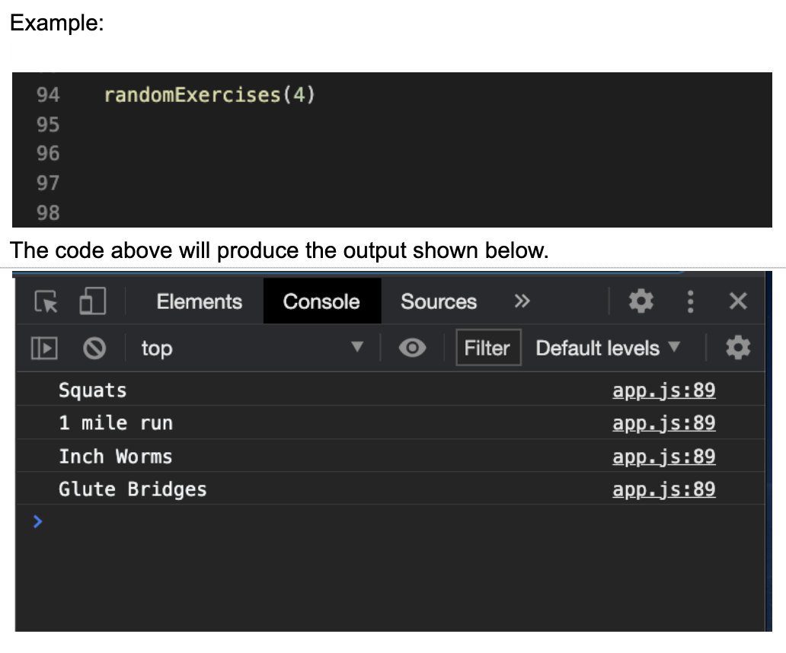

# Functions, Scope & Program Flow - Debrief

## Instructions

* Start by linking your js file to your html file
* Open in browser/live server so you can see your changes in the console

1. Random Exercise Generator

* You will be creating a Random Exercise Generator. Build an array with the items listed below in it. Then create a function (using regular function syntax) that will select a specified number of exercises (number will be passed into the function) and prints the random exercises to the console. It is ok if an exercise appears more than once in the output.

* `Array Items:` "Push-ups", "Sit-ups", "Bear Crawls", "1 mile run", "60 second plank", "Burpees", "Jumping Jacks", "Squats", "Weighted Squats", "Inch Worms"

* Once #1 is complete, create a function with the same functionality as #1, but this time using an arrow function.

## 🏆 Bonus

1. Password Generator: https://github.com/zchalk/password-generator-learner-copy

2. FizzBuzz Function
   * Using the Instructions below, write a function that prints numbers from 1 to an upper limit. That upper limit should be passed into your function as an argument.
    * Ex. fizzBuzz(15) should print the fizzBuzz pattern described below from 1 to the upper limit of 15.
   * Instructions: For numbers from 1 to an upper limit (inclusive), print 'Fizz' to the console if the number is a multiple of 3, print 'Buzz' if it is a multiple 5, print 'FizzBuzz' if it a multiple of both 3 and 5. Otherwise, print the number to the console. Be sure to check that number your `upperLimit` is of type `number`.

   ### 💡 Hint

   You can use the `JS/01-intro-to-js/Activities/practice/05-conditionals-if-else/solved` to get started on this.

2. E-Commerce Item list Function
    * Use the requiremets below to create a function that takes in an item and prints the price to the console.
    * Use a switch statement to print the price of the each item in the store to the console.
    * Ex. `itemList('shoes')` should print `Shoes are $50` to the console

    Items:
     * Shoes- $50
     * Jeans- $25
     * Hat- $12
     * Socks- $2
     * If the function input is not an item in the store, then print 'Invalid Item' to the console.

   ### 💡 Hint

   You can use the `JS/01-intro-to-js/Activities/practice/07-switch-statement/solved` to get started on this.

## Resources

* <https://docs.google.com/document/d/1XtPcr32J-wImjtBidKNFIvDIoKR3yPvWO5TRjS5owb4/edit?usp=sharing>
* <https://developer.mozilla.org/en-US/docs/Learn/JavaScript/First_steps/What_is_JavaScript>
* <https://developer.mozilla.org/en-US/docs/Learn/JavaScript/First_steps/Variables#what_is_a_variable>
* <https://developer.mozilla.org/en-US/docs/Learn/JavaScript/First_steps/Variables#variable_types>
* <https://developer.mozilla.org/en-US/docs/Web/JavaScript/Reference/Global_Objects/Math>
