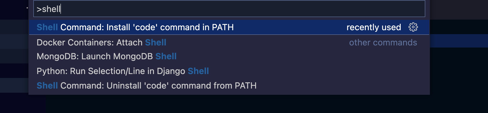

# Git Resources

## Links

- [What is Git: Features, Command and Workflow in Git](https://www.simplilearn.com/tutorials/git-tutorial/what-is-git)
- [Git Wiki Page](https://en.wikipedia.org/wiki/Git#:~:text=Git%20was%20originally%20authored%20by,has%20been%20the%20core%20maintainer.)
- [What is Git? | Official Documentation](https://git-scm.com/book/en/v2/Getting-Started-What-is-Git%3F)
- [Offical Git Website](https://git-scm.com/)
- [Remove .vs folder from git](https://www.codegrepper.com/code-examples/shell/remove+.vs+folder+from+git)
- [Git Cheatsheet](https://education.github.com/git-cheat-sheet-education.pdf)
- [vim cheatsheet](https://vim.rtorr.com/)

## Videos

- [Git Tutorial for Beginners: Learn Git in 1 Hour | Code with Mosh](https://www.youtube.com/watch?v=8JJ101D3knE&t=1s)
- [Learn Git in 15 Minutes](https://www.youtube.com/watch?v=USjZcfj8yxE)
- [Git Tutorial for Beginners - Git  & GitHub Fundamentals in Depth | Tech with Tim](https://www.youtube.com/watch?v=DVRQoVRzMIY&t=428s)
- [Git and GitHub for Beginners - Crash Course | Free Code Camp](https://www.youtube.com/watch?v=RGOj5yH7evk&t=1s)

## Visuals

- 
