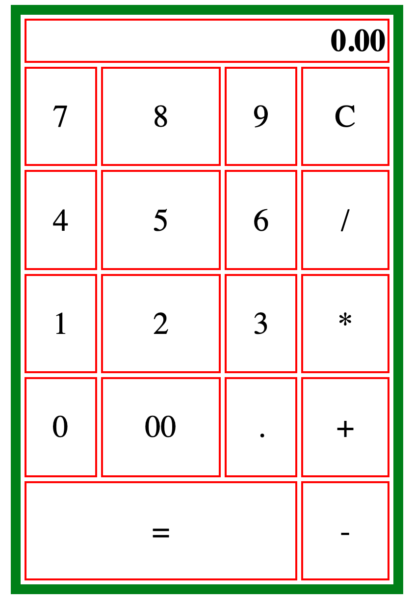

# Build a Calculator with HTML

* Objective - Create the basic calculator layout shown in the image below
* Purpose - Apply what was learned during the HTML Codecademy modules by creating the calculator shown below.
* Strecth Goal - Use CSS to add the colors shown in the example.

