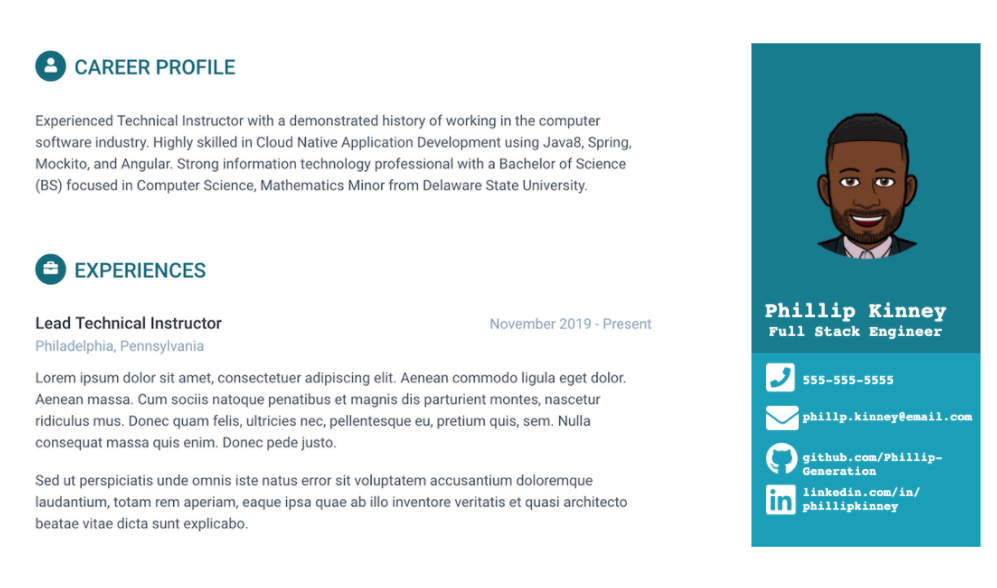

# Online Resume Activity

* **Objective** - To create a personalized online resume detailing your career profile (or professional summary), experience, and education.
* **Purpose** - To establish familiarity with CSS and HTML.
* **Description**
    * You are provided with an `index.html` document at the root of this project, and a `style.css` in the `css` folder.
    * Edit the document by adding information about yourself to it.
    * Use the skills learned in the HTML and CSS lessons to complete this project.
    * "Ask three before me"
        * We are here to help, but please check web resources or consult with peers prior to asking Instructor/TAs. This helps build your "search muscles" which are very important to your future roles as Developers.
    * The objective is to achieve a portfolio with comparable quality to the image below. But feel free to make it your own!
    * You may want to spend more time on this after class to make this an excellent project to add to your portfolio!

Adapted from Leon Hunter.
