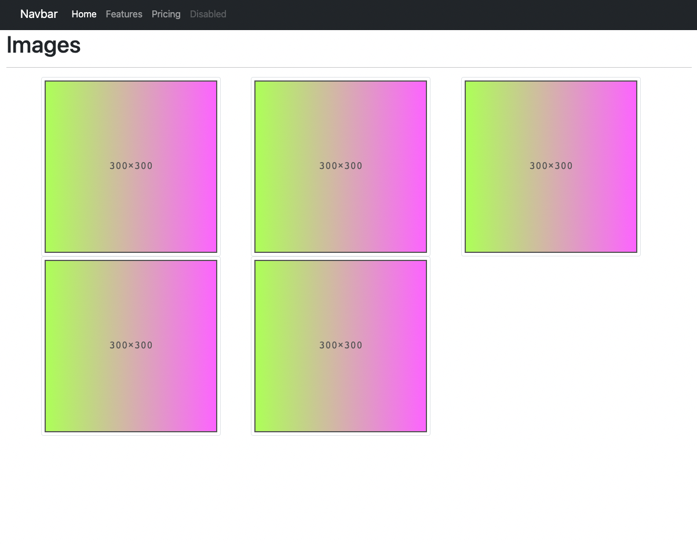
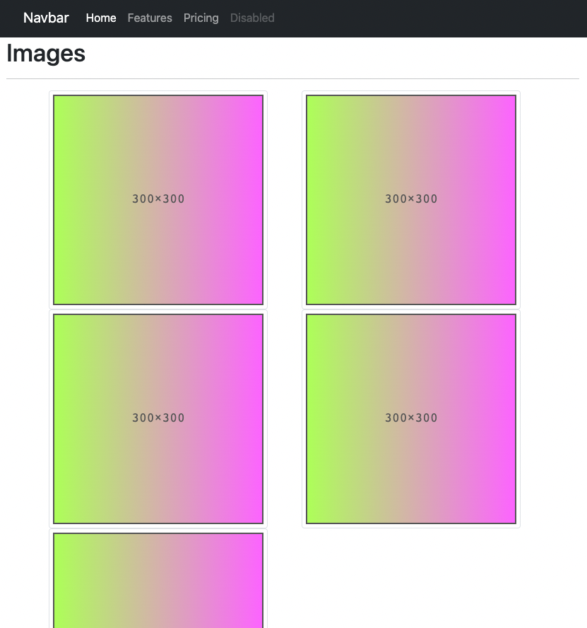
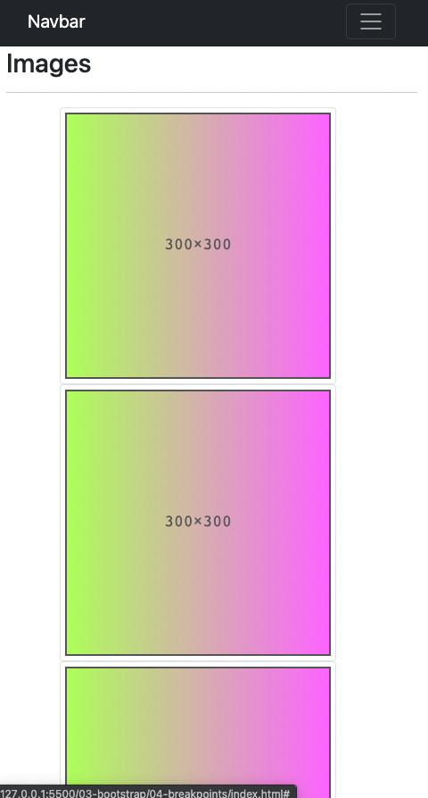

# Breakpoint Practice

- Start by creating a new branch for this activity

- Check out bootstrap documentation for more info on their [breakpoints](https://getbootstrap.com/docs/5.1/layout/breakpoints/) 

- You will not need to add any html to fix the responsiveness for the page

- Use bootstrap classes to get the page to display like the following images as you resize it.

- When the browser is a larger size it should be able to fit 3 images in a horizontal line and the navbar should be displayed as such...

- When the browser is more of a medium size it should be able to fit 2 images in a horizontal line and the navbar should be displayed like so...

- When the browser is more of a small size each image should be on its own line and the navbar should become a dropdown display like so...

