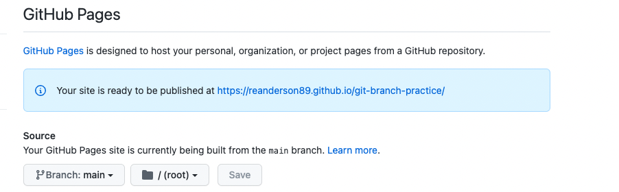
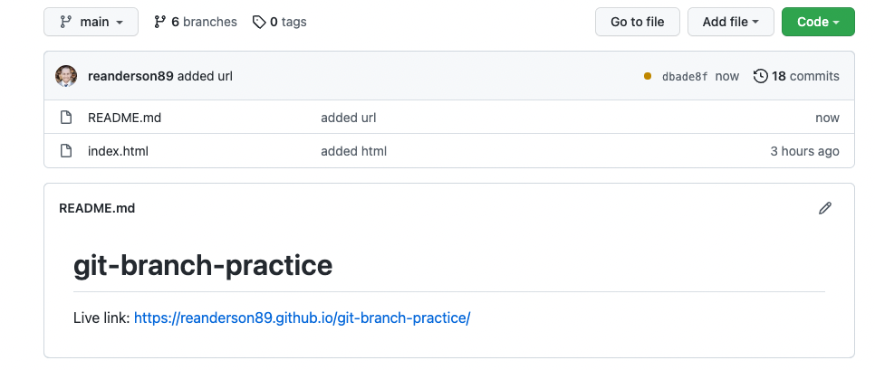

# Deploying to github pages

1. **Create and clone a repository, push your changes back up to GitHub**

- `Create` a new repository on Github
- `Clone` the new repository down to your computer
- add an `index.html` file
- `add something to the body` of the HTML file (*inbetween the opening and closing body tags*)
  - *could be `<h1>Your Name</h1>`, could be an `` of something.
  - You might have to google or use other README's if your unsure.
- `add, commit, and push` your changes to github.

2. **Deploy to GitHub Pages**

- In your repository on github, go to the `"Settings" tab`
- then click the `"Pages" tab` on the left.
- Under `Source`, click where it says `"none"` and select `"main"`
- then `click save`

- This will produce a URL to a live page just above the dropdown menu you clicked on.
- ***Note:*** It may not work for a minute or two while it has the blue background color.

3. **View your Deployed Site**

- Refresh the page after a minute or two and you will notice that the background for the URL is now green.
- Click the URL to test that it works
- then add it to your README.md.

- After you have added your URL to your README.md, `add, commit, and push those changes` to github.
- You should now see the live link on your repository home page on github.

## **BONUS**

1. Make your `font style` *italic* and/or **bold** on your README.md

2. Take a `screenshot` of your live page and display it on your README.md
